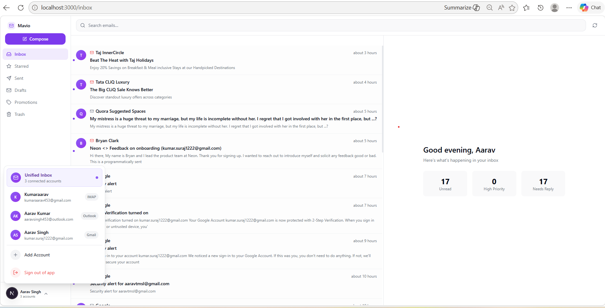
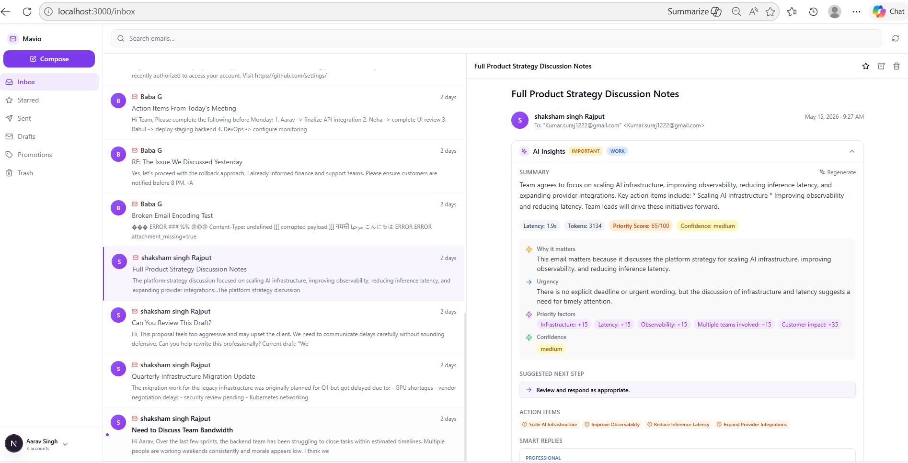
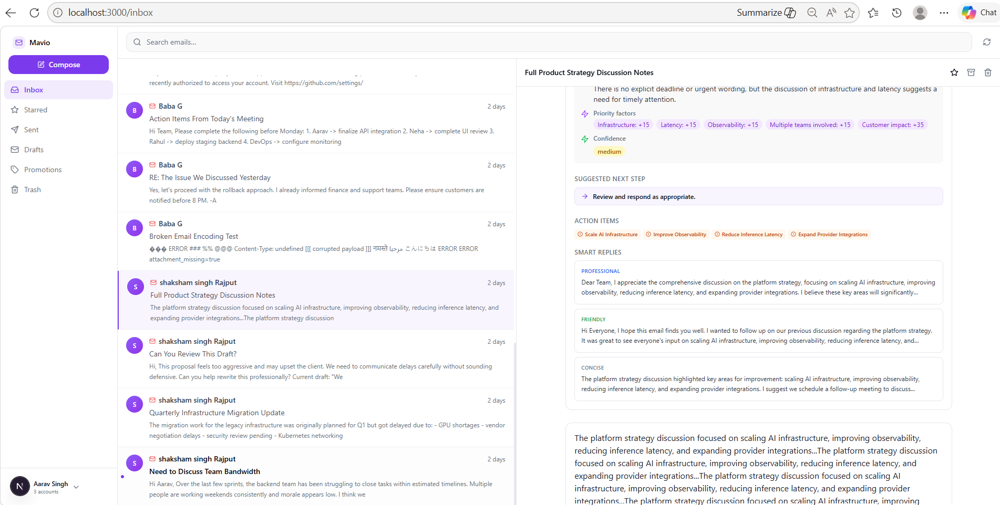
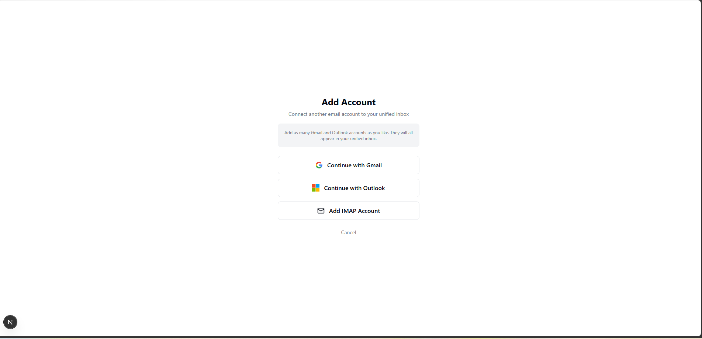
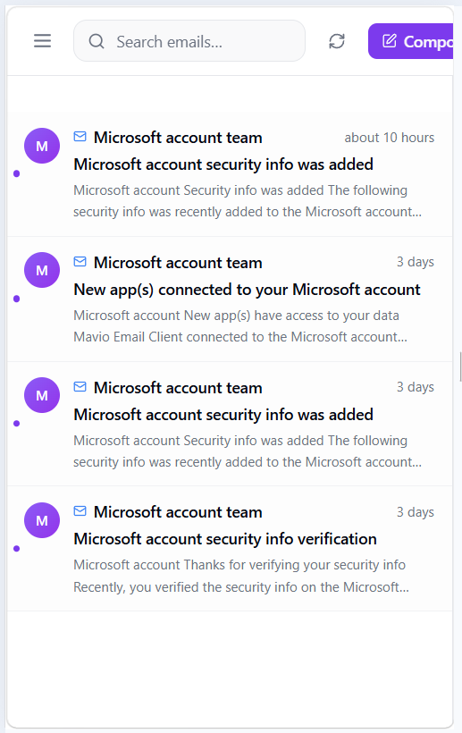

# Mavio - AI-First Email Client

An AI-first email client MVP built with Next.js 15, featuring explainable AI insights, smart replies, and intelligent prioritization.

## Mobile Implementation

The application is a mobile-ready PWA with responsive design:
- Mobile navigation drawer with full account switching
- Responsive inbox layout with adaptive email list/detail views
- Touch-optimized compose modal with proper viewport handling
- PWA manifest for installability on mobile devices
- Responsive spacing and component sizing across breakpoints

## OAuth Redirect URI Configuration

**Critical for Vercel Deployment:**

When deploying to Vercel, you must update the OAuth redirect URIs in your provider consoles:

1. **Google Cloud Console** (https://console.cloud.google.com/apis/credentials)
   - Add your Vercel URL (e.g., `https://mavio.vercel.app/api/auth/callback/google`) to Authorized redirect URIs

2. **Azure AD App Registration** (https://portal.azure.com/#view/Microsoft_AAD_RegisteredApps/ApplicationsListBlade)
   - Add your Vercel URL (e.g., `https://mavio.vercel.app/api/auth/callback/azure-ad`) to Redirect URIs

3. **Vercel Environment Variables**
   - Set `NEXT_PUBLIC_APP_URL` to your deployed Vercel URL (e.g., `https://mavio.vercel.app`)
   - Set `NEXTAUTH_URL` to your deployed Vercel URL

---

## Deliverables (per the brief)

| Deliverable | Location |
|---|---|
| Live Vercel URL | https://mavio.vercel.app |
| `CLAUDE.md` | [`docs/CLAUDE.md`](docs/CLAUDE.md) (project context) |
| One-page architecture doc | [`docs/architecture.md`](docs/architecture.md) |
| List of agents / skills / hooks / plugins | [`docs/AGENTS_SKILLS_HOOKS_PLUGINS.md`](docs/AGENTS_SKILLS_HOOKS_PLUGINS.md) |
| Workflow writeup | [`docs/agent-workflow.md`](docs/agent-workflow.md) |
| Automated tests | `{agents,skills,lib}/__tests__/` (Jest, 15 test files) |
| CI | [`.github/workflows/ci.yml`](.github/workflows/ci.yml) — lint + `tsc --noEmit` + Jest |

---

## Feature snapshot

- **Unified inbox** across Gmail, Office 365 / Outlook, and IMAP (Yahoo, AOL, iCloud, custom)
- **Account switching** between any combination of providers under one login
- **Compose / reply / forward / search / archive / delete / star / read-flag / labels**
- **AI insights per email** — generated summary + 3 smart reply drafts (professional / friendly / concise) + priority score + factors + classification + actions
- **Cross-email pattern detection** — recurring senders, deadline clusters, unreplied urgent
- **Smart folder suggestions** — bulk-organize actions
- **Semantic search** with pgvector + keyword fallback (gracefully degrades when embeddings unavailable)
- **Keyboard shortcuts** — j/k navigation, e archive, r reply, c compose, s star, ? help
- **Encrypted IMAP credentials** at rest (AES-256-GCM)
- **Installable PWA** — manifest + standalone display
- **Mobile-responsive UI** with navigation drawer

## Tech stack

| Layer | Choice |
|---|---|
| Framework | Next.js 15 App Router (fullstack, single deployment) |
| Language | TypeScript (strict) |
| Auth | Custom JWT session in `lib/oauth.ts` + Google OAuth + Azure AD (refresh-token rotation) |
| Database | Neon Postgres + Prisma + pgvector |
| AI | Groq SDK · `llama-3.3-70b-versatile` |
| Embeddings | Hugging Face inference · `sentence-transformers/all-MiniLM-L6-v2` |
| Email APIs | googleapis (Gmail v1) · Microsoft Graph v1 (Outlook) · imapflow + nodemailer + mailparser (IMAP/SMTP) |
| UI | Tailwind CSS + Radix UI + Lucide icons |
| PWA | next-pwa + manifest |
| Hosting | Vercel |

---

## Repo layout

```
.
├── README.md                       — this file
├── .github/workflows/ci.yml        — lint + typecheck + tests on every push/PR
├── docs/
│   ├── CLAUDE.md                   — project context for AI pair-programmer
│   ├── architecture.md             — one-page architecture
│   ├── agent-workflow.md           — workflow writeup
│   ├── AGENTS_SKILLS_HOOKS_PLUGINS.md
│   └── screenshots/
├── app/                            — routes + API handlers
├── agents/                         — 7 AI agents (Groq prompts)
├── skills/                         — 5 reusable pure functions
├── hooks/                          — 4 hooks (3 lifecycle + 1 UI keyboard hook)
├── plugins/                        — 3 EmailProvider plugins (Gmail / Outlook / IMAP)
├── components/                     — React UI
├── lib/                            — providers, orchestrator, ai, oauth, encryption, db
└── prisma/schema.prisma
```

---

## Screenshots

### Unified inbox + AI insights


### AI insight panel


### Smart reply drafts (3 tones)


### Add account flow


### Mobile responsive view


---

## Why this architecture

### Monolithic Next.js fullstack
One Vercel deployment. No FastAPI sidecar, no separate worker, no service mesh. Faster iteration; easy to extract microservices later if scale demands it.

### Pragmatic multi-agent, not LangGraph
The seven agents are specialized prompt-functions sharing a Groq client. They run sequentially in `lib/orchestrator.ts` from `POST /api/ai/analyze`. This is **deliberate** — every operation is single-pass; LangGraph would only inflate latency and cost for an MVP. The seam to add a real DAG is in place.

### On-demand AI with DB cache
Free Groq tier is 14,400 requests/day. Background analysis on every fetched email burns it in minutes. AI runs only when the user clicks **Generate**; results persist to `Email.ai*` columns and load instantly thereafter.

### Three real providers, not stubs
- Gmail — googleapis + Google OAuth, refresh-token rotation
- Outlook / Office 365 — Microsoft Graph + Azure AD, custom Prisma adapter to strip `ext_expires_in`
- IMAP — imapflow + nodemailer + mailparser, AES-256-GCM password encryption

IMAP archive/trash/star/search are deliberately handled DB-side because folder semantics vary across servers — see the inline note in `lib/providers/imap.ts`.

---

## Local setup

```bash
npm install
cp .env.example .env.local       # then fill in keys (see below)
npx prisma generate
npx prisma db push               # push schema to Neon
npm run dev                      # http://localhost:3000
```

### Required environment variables

| Variable | Source |
|---|---|
| `NEXTAUTH_SECRET` | `openssl rand -base64 32` |
| `GOOGLE_CLIENT_ID` / `GOOGLE_CLIENT_SECRET` | Google Cloud Console → OAuth client. Redirect URI: `http://localhost:3000/api/auth/callback/google` |
| `AZURE_AD_CLIENT_ID` / `AZURE_AD_CLIENT_SECRET` / `AZURE_AD_TENANT_ID` | Azure Portal → App registrations. Redirect URI: `http://localhost:3000/api/auth/callback/azure-ad` |
| `GROQ_API_KEY` | https://console.groq.com/keys (free, 14,400 req/day) |
| `HF_API_KEY` | https://huggingface.co/settings/tokens (free, used for semantic search embeddings) |
| `DATABASE_URL` / `DIRECT_URL` | Neon project connection strings |
| `ENCRYPTION_KEY` | `node -e "console.log(require('crypto').randomBytes(32).toString('hex'))"` (required for IMAP password encryption) |

### Run the test suite

```bash
npm test                  # Jest unit tests
npx tsc --noEmit          # type-check
npm run lint
```

CI runs lint, typecheck, and Jest on every push and pull request.

---

## Deploy to Vercel

1. Push the repo to GitHub.
2. Import on Vercel.
3. Paste the same env vars from `.env.local`.
4. Add the deployed Vercel URL to the Google OAuth + Azure AD authorised redirect URIs.
5. Set `NEXTAUTH_URL` to your Vercel URL.

---

## Honest scope

**Implemented and working:**
Unified inbox · Gmail / Outlook / IMAP · account switching · compose / reply / forward / search · archive / delete / star / mark read · AI summary · explainable priority · 3-tone reply drafts · classification · pattern detection · folder suggestions · keyboard shortcuts · onboarding · encrypted IMAP creds · PWA · mobile-responsive UI.

**Deferred / MVP Tradeoffs (see Known MVP Tradeoffs section below):**
Conversation threading · semantic search embeddings disabled (graceful keyword fallback) · message-level offline sync via IndexedDB · push notifications · IMAP archive/trash at the IMAP layer (DB-side only) · advanced label management · analytics dashboard.

---

## Known MVP Tradeoffs

### Semantic Search
- **Status**: Functional with graceful fallback
- **Details**: The pgvector extension is enabled in the database schema, and the semantic search API route exists (`/api/emails/semantic-search`). The `aiEmbedding` column is commented out in `prisma/schema.prisma` with the note `// pgvector extension disabled for now`. The search route implements defensive engineering: it attempts pgvector cosine similarity search first, and if the column is unavailable, gracefully falls back to case-insensitive keyword search across subject, fromName, fromEmail, and snippet fields. The response includes a `method` field (`'semantic'` vs `'fallback-keyword'`) so the caller knows which path executed. The Hugging Face embeddings API integration exists in `lib/ai/embeddings.ts` but is not wired to the email ingestion pipeline.

### IMAP Provider Limitations
- **Status**: DB-side operations only
- **Details**: IMAP archive, trash, and star operations are handled at the database layer only, not at the IMAP protocol layer. This creates a disconnect between the app state and the actual IMAP server state. This is documented in `lib/providers/imap.ts` as a deliberate MVP tradeoff due to folder semantic variability across IMAP servers.

### Conversation Threading
- **Status**: Not implemented
- **Details**: Each email thread renders as the first message only. No conversation threading or message grouping is implemented. This is a core email client feature deferred for MVP scope.

### Offline Sync
- **Status**: PWA shell only
- **Details**: The app has a PWA manifest and can be installed, but message-level offline sync via IndexedDB is not implemented. Users must be online to fetch and view emails.

### Push Notifications
- **Status**: Not implemented
- **Details**: The app uses 30-second polling for new email detection instead of push notifications. This is a battery and resource tradeoff for MVP.

### Mobile Experience
- **Status**: Responsive but not mobile-optimized
- **Details**: The app has responsive layouts and a mobile navigation drawer, but is not fully optimized for mobile UX. Some interactions and layouts are desktop-first.

---

## License

MIT
